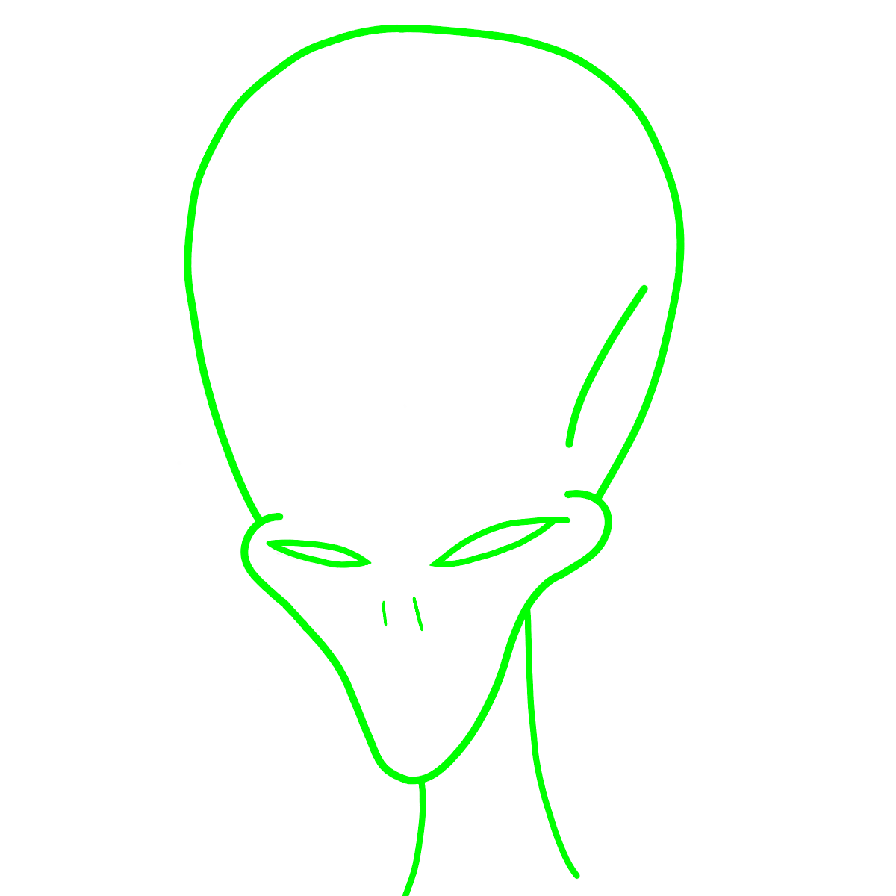

  <h1>
    Personal Portfolio Website 
    <a href="https://exulgor.com">exulgor.com</a>
  </h1>
   
  

## Created by
Justin Thoreson a.k.a. Exulgor

## Description
My personal portfolio website portraying elements of my background including education, experience, and projects.

## Tools & Technologies

